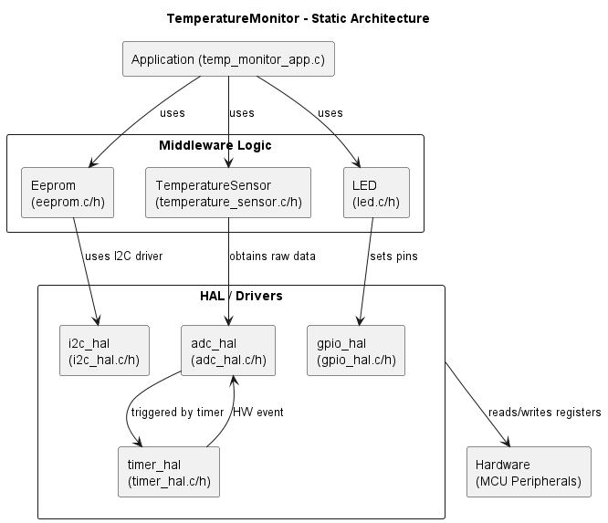
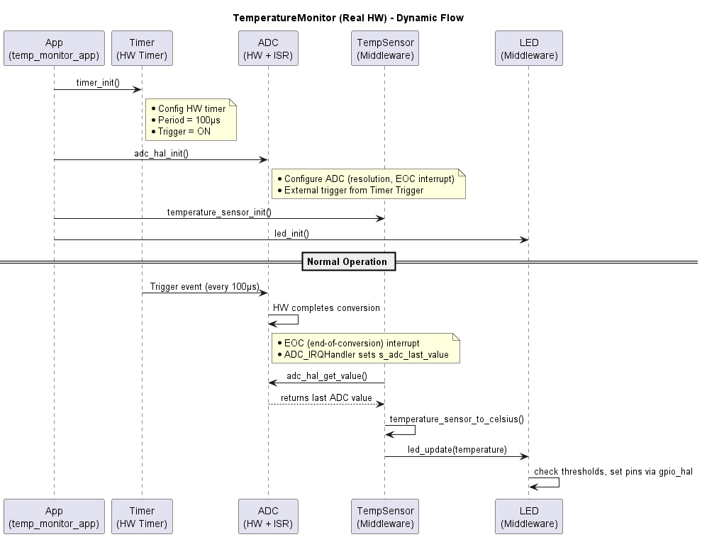

# Architecture Document

## 1. Introduction

This document describes the software architecture of the **TemperatureMonitor** project—a demonstration of a scalable embedded system for temperature monitoring. The design is organized in layers that separate low-level hardware access (I²C, GPIO, Timer, ADC) from higher-level domain logic (EEPROM, LED, Temperature Sensor) and the application layer. This architecture is designed to be maintainable, testable, and scalable.

For an overview of the full project description, please see **Document “neu_embedded_task”**, which outlines the high-level goals, requirements, and constraints.

---

## 2. Static Architecture

### 2.1 Overall Layered Structure

### 2.2 Module Responsibilities

- **main**  
  - A minimal entry point that calls `temp_monitor_app_init()` and `temp_monitor_app_run()`.

- **temp_monitor_app**  
  - Orchestrates system initialization (calls init functions for EEPROM, Temperature Sensor, LED, Timer, ADC, etc.) and manages the main application loop.

- **eeprom**  
  - Uses the **i2c_hal** module to read and write configuration data (hardware revision and serial number) from an external EEPROM.
  
- **temperature_sensor**  
  - Retrieves the most recent ADC reading (via `adc_hal_get_value()`) and converts it to a temperature (°C) using scaling factors based on the hardware revision (Rev-A vs. Rev-B).

- **led**  
  - Determines which LED should be activated (green, yellow, or red) based on the current temperature and pre-defined thresholds.  
  - Uses **gpio_hal** to actually set the pin states.

- **i2c_hal**  
  - *Real Hardware:* Initializes I²C registers, sets up pins, configures bus speed, and handles actual I²C transactions.  
  - *Simulation:* Prints debug messages and returns dummy data.

- **gpio_hal**  
  - *Real Hardware:* Enables GPIO clocks, configures pin modes (e.g., output, push-pull), and writes directly to registers. 
  - *Simulation:* Simply prints the intended pin state changes.

- **timer**  
  - *Real Hardware:* Configures a timer with prescaler values for a precise 100 µs period, and sets up a trigger output to start ADC conversions automatically.  
  - *Simulation:* Emulates a timer event by calling a function (e.g., `timer_emulate_period_event()`) that triggers the ADC conversion.

- **adc_hal**  
  - *Real Hardware:* Configures the ADC (resolution, sampling time, external trigger via timer trigger) and uses an ADC conversion-complete interrupt (e.g., `ADC_IRQHandler`) to update a global value.  
  - *Simulation:* Increments a mock ADC value and stores it in a global variable, mimicking an ISR behavior.

---

## 3. Dynamic Architecture

### 3.1 Sequence Diagram

### 3.2 Detailed Flow

1. **Initialization:**  
   The application layer (`temp_monitor_app_init()`) initializes all modules. In real hardware, each module configures its peripheral only once.

2. **ADC Triggering:**  
   - In real hardware, a timer configured for 100 µs automatically generates a trigger signal that triggers the ADC.  
   - In simulation mode, the timer module emulates this event by calling `adc_hal_trigger_conversion()`.

3. **ADC Conversion and ISR:**  
   - The ADC begins conversion upon receiving the trigger and, once complete, raises an interrupt.  
   - The official ISR (`ADC_IRQHandler`) is called and updates a global variable (`s_adc_last_value`).

4. **Data Flow to Temperature Sensor:**  
   The temperature sensor module retrieves the ADC value via `adc_hal_get_value()`, converts it to Celsius (using hardware revision scaling), and passes this value to the LED module.

5. **LED Update:**  
   The LED module uses temperature thresholds (configured in `cfg.h`) to determine which LED to activate, calling `gpio_write_pin()` from the GPIO HAL.

---

## 4. Real Hardware Considerations

- **EEPROM:**  
  In a real system, the EEPROM module would use I²C communication (handled by the i2c_hal module) to read/write non-volatile configuration data.  
  - *Example:* Using `HAL_I2C_Mem_Read()` on an STM32.

- **GPIO:**  
  The GPIO HAL would set up the GPIO ports and pins by enabling clocks and configuring pin modes.  

- **ADC:**  
  The ADC module would be configured for the required resolution and sampling time. It would be set to start conversion via an external trigger, and its end-of-conversion interrupt (`ADC_IRQHandler`) would be used to update the latest reading.  

- **Timer:**  
  The timer module configures a hardware timer to operate at a 100 µs interval, outputting a trigger signal for the ADC.  

---

## 5. Conclusion

This architecture provides:

- A **static, layered structure** with well-defined modules (low-level drivers, middleware, and application layer).  
- A **dynamic data flow** where the timer triggers the ADC, the ADC interrupt updates a global variable, the temperature sensor converts the value, and the LED module updates outputs accordingly.  
- Clear separation of concerns that facilitates maintainability, testability, and scalability in a complex embedded system.

This document and accompanying diagrams illustrate both the **static architecture** (module structure and dependencies) and the **dynamic behavior** (runtime data flow), making it a comprehensive reference for understanding the TemperatureMonitor project's design.

---

## 6. Traceability to Document “neu_embedded_task”

**Document “neu_embedded_task”** contains the **project description**, outlining the requirements and objectives for the TemperatureMonitor system. This architecture document references those requirements and constraints as follows:

1. **Timer Interval** (Requirement in “neu_embedded_task” stating 100 µs sampling):  
   - Mapped to `timer_hal` usage with a 100 µs period, ensuring minimal jitter.  
2. **Temperature Range** (Ok/Warning/Critical in doc “neu_embedded_task”):  
   - Mapped to **LED** thresholds (5 °C, 85 °C, 105 °C) in the **LED domain** module.  
3. **Hardware Revision** reading (described in doc “neu_embedded_task” for supporting Rev-A or Rev-B sensors):  
   - Implemented by **Eeprom** (using `i2c_hal`) and used by **TemperatureSensor** to scale ADC data differently.  

This ensures every key requirement from the “neu_embedded_task” document is addressed within our layered architecture, making it clear **where** each requirement is fulfilled in the code structure.

---

*End of Architecture Document*
